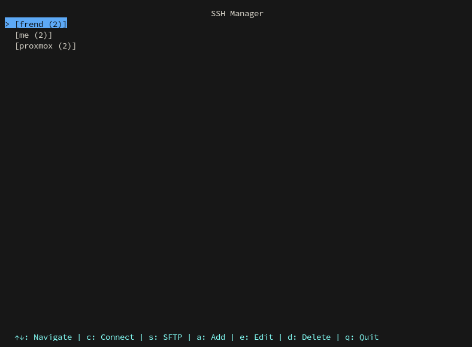
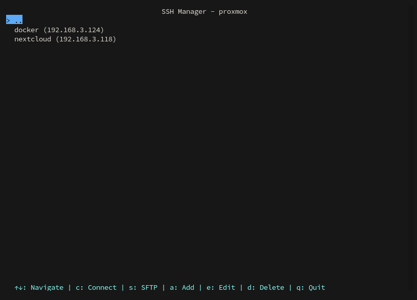

# SSH Manager (sshm)

A modern, user-friendly TUI (Text User Interface) for managing SSH connections. Built with Python and curses, it provides an intuitive interface for managing SSH connections, groups, and quick access to your servers.




## Features

- 🔐 Secure storage of SSH credentials using encryption
- 📁 Hierarchical group organization
- 🎨 Modern TUI with transparent background
- ⌨️ Keyboard-driven interface
- 🔑 Support for both password and key-based authentication
- 🔄 Quick toggle for password visibility
- 📋 SFTP support
- 🏷️ Custom connection naming
- 🔍 Easy navigation through groups and connections

## Installation

### Prerequisites

- Python 3.8 or higher
- `sshpass` (for password authentication)
- Terminal with 256-color support (recommended)

### From PyPI

```bash
pip install sshm
```

### From Source

1. Clone the repository:
```bash
git clone https://github.com/lele7663/sshm.git
cd sshm
```

2. Install dependencies:
```bash
pip install -r requirements.txt
```

```

### Distribution-Specific Installation

#### Arch Linux
```bash
# Install sshpass
sudo pacman -S sshpass

# Install sshm
pip install sshm
```

#### Debian/Ubuntu
```bash
# Install sshpass
sudo apt-get install sshpass

# Install sshm
pip install sshm
```

#### Fedora
```bash
# Install sshpass
sudo dnf install sshpass

# Install sshm
pip install sshm
```

## Usage

### Starting the Application

```bash
sshm
```

### Key Bindings

#### Main Menu
- `↑/↓`: Navigate through connections and groups
- `Enter`: Select/Open group or connection
- `c`: Connect to selected server via SSH
- `s`: Connect to selected server via SFTP
- `a`: Add new connection
- `e`: Edit selected connection
- `d`: Delete selected connection
- `q`: Quit application

#### Connection Form
- `↑/↓`: Navigate through fields
- `Enter`: Save connection
- `Esc`: Cancel and return to main menu
- `Ctrl+T`: Toggle password visibility (when in password field)

### Connection Configuration

When adding or editing a connection, you can configure:
- Name: Custom name for the connection
- Host: Server hostname or IP address
- Port: SSH port (default: 22)
- Username: SSH username
- Password: SSH password (optional)
- Key Path: Path to SSH private key (optional)
- Group: Hierarchical group path (e.g., "production/web-servers")

### Groups

Groups allow you to organize your connections hierarchically:
- Use `/` to create nested groups (e.g., "production/web-servers")
- Navigate through groups using arrow keys
- Press `Enter` to enter a group
- Use `..` to go back to parent group

## Configuration

The application stores its configuration in `~/.ssh-manager/`:
- `config.json`: Encrypted connection database
- `.key`: Encryption key for the database

## Security

- All credentials are encrypted using Fernet (symmetric encryption)
- Passwords are never displayed by default
- SSH keys are stored as file paths, not the actual keys
- Configuration files are stored with appropriate permissions

## Contributing

Contributions are welcome! Please feel free to submit a Pull Request.

### Development Setup

1. Fork the repository
2. Create a virtual environment:
```bash
python -m venv venv
source venv/bin/activate  # On Windows: venv\Scripts\activate
```

3. Install development dependencies:
```bash
pip install -r requirements.txt
pip install -e .
```

### Running Tests

```bash
pytest
```

## License

This project is licensed under the MIT License - see the [LICENSE](LICENSE) file for details.

## Acknowledgments

- [curses](https://docs.python.org/3/library/curses.html) for the TUI framework
- [cryptography](https://cryptography.io/) for secure credential storage
- [paramiko](https://www.paramiko.org/) for SSH functionality

## Support

If you encounter any issues or have questions, please open an issue on the GitHub repository.

